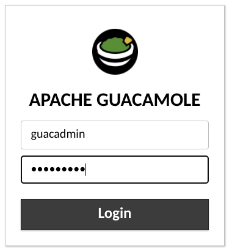
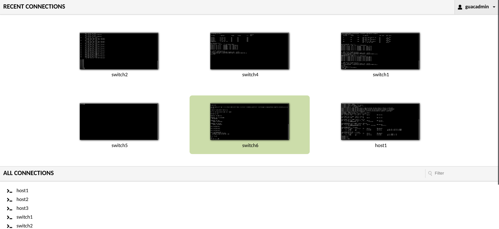

# lab-in-a-box

Quickly Deploy a Network for Learning and Development

## Why

This repository creates the scaffolding needing to quickly deploy an arbitrarily large network topology with connected hosts. What you do with it is entirely up to you. However, consider testing beyond the scope of routing and switching and pinging devices in the topology. Instead, what else can you connect to this environment? Have you ever wanted to try your hand at network discovery and mapping? Or see how a particular piece of software will interact in a network? A VM hosted on KVM could easily be bridged into this environment...

## Topology


## Prerequisites

The following is a list of services required to use **lab-in-a-box**. The links below will refer you to build product documentation or build instructions for the respective service.

- [containerlab](https://containerlab.srlinux.dev/install/)

Orchestrates infrastructure build of nodes and network connections.

- [docker-ce](https://www.digitalocean.com/community/tutorials/how-to-install-and-use-docker-on-ubuntu-20-04)

Container service for network and server devices.

- [Arista cEOS](https://www.arista.com/en/products/software-controlled-container-networking)

Provides free access to an industry leading network operating system (NOS).

- [Ansible](https://www.digitalocean.com/community/tutorials/how-to-install-and-configure-ansible-on-ubuntu-20-04)

Configuration management for the instantiated infrastructure by containerlab.

- [oznu/guacamole](https://hub.docker.com/r/oznu/guacamole/)

Guacamole three-tier app packaged in a single, easy to use container.

## Building Containers

### nettest

```shell
cd containers/nettest/
```

The credentials used in this environment are **admin/admin**. Simply replace <VAR> with the **admin** value when you create the container.

```shell
docker image build --tag nettest:1.0.0 --build-arg USER=<VAR> --build-arg PSWD=<VAR> .
```

### ceos
  
Assuming you have downloaded the cEOS tar file and are in the directory it is located in. If you download a different version than I have make sure you update accordingly.
  
```shell
docker import cEOS-lab-4.27.2F.tar
```
  
### oznu/guacamole
  
```shell
 docker pull oznu/guacamole
```

This will store guacamole configuration folder and files in your user's root directory.
  
```shell
docker run -d -p 8080:8080 -v $HOME/guacamole:/config --name guac oznu/guacamole
```

Optionally, update the guac container so that it restarts after a system reboot.
  
```shell
 docker update --restart unless-stopped guac
```
  
## Deploying the Lab

Assumes working from the main directory of the repository.  
  
### Step 1 - Deploy
  
```shell
sudo clab deploy --topo routing.yml
```

### Step 2 - Create Inventory Sym Link

(optional) Create a symbolic link to ansible-inventory generated by containerlab. This is optional, but saves you from having to type the path to this file. All commands shown after this will reference the sym link.

```shell
ln clab-routing/ansible-inventory.yml inventory.yml
```

### Step 3 - Setup Infrastructure  
  
```shell
ansible-playbook -i inventory.yml ceos_deploy.yml  
```  
  
### Step 4 - Validate Infrastructure
  
The output from the playbook will only show statistics if it encounters 100% loss on a connection.

```shell
ansible-playbook -i inventory.yml ceos_validate.yml  
```

Example output from a successful deployment. At least one packet made it its destination.
  
```shell
ok: [clab-routing-switch2] => {
    "msg": [
        "PING 10.0.12.1 (10.0.12.1) 72(100) bytes of data.",
        "PING 10.0.23.2 (10.0.23.2) 72(100) bytes of data.",
        "PING 10.0.24.2 (10.0.24.2) 72(100) bytes of data.",
        "PING 10.0.25.2 (10.0.25.2) 72(100) bytes of data.",
        "PING 2001:10:0:12::1(2001:10:0:12::1) 72 data bytes",
        "PING 2001:10:0:23::2(2001:10:0:23::2) 72 data bytes",
        "PING 2001:10:0:24::2(2001:10:0:24::2) 72 data bytes",
        "PING 2001:10:0:25::2(2001:10:0:25::2) 72 data bytes"
    ]
}
```  

Example outfrom a failed or non-configured deployment. Complete packet loss to device's peers.
  
```shell
ok: [clab-routing-switch4] => {
    "msg": [
        "PING 10.0.14.1 (10.0.14.1) 72(100) bytes of data.",
        "5 packets transmitted, 0 received, 100% packet loss, time 40ms",
        "PING 10.0.24.1 (10.0.24.1) 72(100) bytes of data.",
        "5 packets transmitted, 0 received, 100% packet loss, time 40ms",
        "PING 10.0.34.1 (10.0.34.1) 72(100) bytes of data.",
        "5 packets transmitted, 0 received, 100% packet loss, time 40ms",
        "PING 10.0.45.2 (10.0.45.2) 72(100) bytes of data.",
        "5 packets transmitted, 0 received, 100% packet loss, time 40ms"
    ]
}
```
  
### Step 5 - Setup Hosts

```shell
ansible-playbook -i inventory.yml linux_deploy.yml  
```    

### Step 6 - Validate Hosts
  
See Step 4 for examples of good/bad output.
  
```shell
ansible-playbook -i inventory.yml linux_validate.yml  
```  
  
### Step 7 - Connect Guacamole to the Lab
  
To establish SSH to the hosts, Guac will need a leg into the management network.  
  
```shell
docker network connect clab_mgmt guac
```

## Interacting with the Lab

### SSH Access from Host  
  
You can find the management IPs of all the devices in the lab in the **routing.yml** file. From the host you deployed this lab on you can simply SSH to the management IP. The default credentials for everything should be **admin/admin** unless you entered something different along the way.

```shell
+----+----------------------+--------------+-----------------+-------+---------+-------------------+------------------------+
| #  |         Name         | Container ID |      Image      | Kind  |  State  |   IPv4 Address    |      IPv6 Address      |
+----+----------------------+--------------+-----------------+-------+---------+-------------------+------------------------+
|  1 | clab-routing-host1   | 6534611a67e0 | nettest:1.0.0   | linux | running | 172.100.100.51/24 | 2001:172:100:100::a/80 |
|  2 | clab-routing-host2   | 8fce1370292b | nettest:1.0.0   | linux | running | 172.100.100.52/24 | 2001:172:100:100::9/80 |
|  3 | clab-routing-host3   | 077e48a45eb3 | nettest:1.0.0   | linux | running | 172.100.100.53/24 | 2001:172:100:100::d/80 |
|  4 | clab-routing-switch1 | 13da2d2d71c2 | ceoslab:4.27.2F | ceos  | running | 172.100.100.11/24 | 2001:172:100:100::5/80 |
|  5 | clab-routing-switch2 | a9ec6d0dbf93 | ceoslab:4.27.2F | ceos  | running | 172.100.100.12/24 | 2001:172:100:100::7/80 |
|  6 | clab-routing-switch3 | af2749d238dc | ceoslab:4.27.2F | ceos  | running | 172.100.100.13/24 | 2001:172:100:100::8/80 |
|  7 | clab-routing-switch4 | 3838b6ab80ce | ceoslab:4.27.2F | ceos  | running | 172.100.100.14/24 | 2001:172:100:100::b/80 |
|  8 | clab-routing-switch5 | 7563cd8ccfc4 | ceoslab:4.27.2F | ceos  | running | 172.100.100.15/24 | 2001:172:100:100::3/80 |
|  9 | clab-routing-switch6 | fe884cbfe9cd | ceoslab:4.27.2F | ceos  | running | 172.100.100.16/24 | 2001:172:100:100::c/80 |
| 10 | clab-routing-switch7 | ce262dc8a0fc | ceoslab:4.27.2F | ceos  | running | 172.100.100.17/24 | 2001:172:100:100::6/80 |
| 11 | clab-routing-switch8 | 536277b101ea | ceoslab:4.27.2F | ceos  | running | 172.100.100.18/24 | 2001:172:100:100::4/80 |
+----+----------------------+--------------+-----------------+-------+---------+-------------------+------------------------+
```
 
### Using Guacamole
  
Assuming you chose to deploy Guacamole, it should be accessible on your hosts IP address. Browse to the address using your Web browser. For my host, the link is as shown below.
 
```shell
http://192.168.5.5:8080
```
  
The default credentials for guac are **guacadmin/guacadmin**.
  

  
After logging in, be sure to setup your server with the configured hosts. 
  

